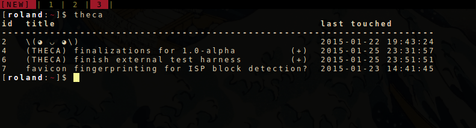

# theca

a minimal command line note taking tool written in [*Rust*](http://www.rust-lang.org/).

## features

* add/edit/delete notes
* add/edit note body using command line arguments, `STDIN`, or using the editor set in `$EDITOR` or `$VISUAL`.
* multiple profile support
* plaintext or 256-bit AES encrypted profiles
* note transfer between profiles
* note searching (title or body) using keyword or regex pattern
* sort notes by date last modified and other list formatting modes
* traditional and condensed printing modes
* *JSON* profile format for easy integration
