	#  _   _                    
	# | |_| |__   ___  ___ __ _
 	# | __|  _ \ / _ \/ __/ _` |
	# | |_| | | |  __/ (_| (_| |
	#  \__|_| |_|\___|\___\__,_|
	#

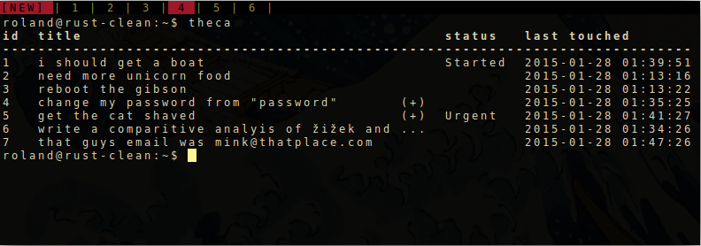

a simple, fully featured, command line note taking tool written in
[*Rust*](http://www.rust-lang.org/). 

## Features

* Multiple profile support
* Plaintext or 256-bit AES encrypted profiles
* *JSON* profile format for easy scripting/integration
* Traditional and condensed printing modes
* Add/edit/delete notes
* Add/edit note body using command line arguments, `STDIN`, or using the editor set via `$VISUAL`
  or `$EDITOR`
* Transfer notes between profiles
* Search notes (title or body using keyword or regex pattern)

## Contents

- [Installation](#installation)
	- [Binaries](#binaries)
	- [From source](#from-source)
- [Usage](#usage)
	- [First run](#first-run)
	- [Adding notes](#adding-notes)
	- [Editing notes](#editing-notes)
	- [Deleting notes](#deleting-notes)
	- [List all notes](#list-all-notes)
	- [View a single note](#view-a-single-note)
	- [Searching notes](#searching-notes)
	- [Non-default profiles](#non-default-profiles)
		- [Setting the default profile](#setting-the-default-profile)
		- [Setting the default profile folder](#setting-the-default-profile-folder)
		- [List all profiles](#list-all-profiles)
		- [Transfer a note to another profile](#transfer-a-note-to-another-profile)
		- [Import a note from another profile](#import-a-note-from-another-profile)
		- [Encrypted profiles](#encrypted-profiles)
			- [Encrypt a plaintext profile](#encrypt-a-plaintext-profile)
			- [Decrypt a encrypted profile](#decrypt-a-encrypted-profile)
			- [Changing the encryption key for an already encrypted profile](#changing-the-encryption-key-for-an-already-encrypted-profile)
		- [Synchronizing profiles](#synchronizing-profiles)
	- [JSON output mode](#json-output-mode)
- [Tab completion](#tab-completion)
- [man page](#man-page)
- [Contributing](#contributing)
	- [Bugs](#bugs)
	- [TODO](#todo)
- [Development](#development)
	- [JSON profile format](#json-profile-format)
	- [Cryptographic design](#cryptographic-design)
		- [Basic Python implementation](#basic-python-implementation)
	- [`tools/build.sh`](#buildsh)
	- [`tools/theca_test_harness.py`](#theca_test_harnesspy)
		- [Test suite file format](#test-suite-file-format)
			- [Test formats](#test-formats)
- [License](#license)

## Installation

### Binaries

I've built a simple multi-(platform/arch) binary package builder (`tools/theca-packer.py`)
based on [Fabric](http://www.fabfile.org/) so I can provide both `x86_64` and `i686` packages
for `unknown-linux-gnu` and `apple-darwin`. I need to setup my website (i'm lazy...) but once
I actually host the packages and stuff it'll be as simple as running

:warning: this doesn't work at the moment :warning:

	$ curl -s https://static.bracewel.net/theca/get_theca.sh | sh

to install `theca`. If you want to uninstall you just need to add the `--uninstall` flag like so

	$ curl -s https://static.bracewel.net/theca/get_theca.sh | sh -s -- --uninstall

### From source

All that's needed to build theca is a copy of the `rustc` compiler and the `cargo` packaging tool which can
be downloaded directly from the [Rust website](http://www.rust-lang.org/install.html) or by running

	$ curl -s https://static.rust-lang.org/rustup.sh | sh

to get the nightly `rustc` and `cargo` binaries, once those have finished building we can clone and build `theca`

	$ git clone https://github.com/rolandshoemaker/theca.git
	...

	$ cd theca
	$ cargo build [--release]
	...

	$ sudo bash tools/build.sh install [--release, --man, --bash-complete, --zsh-complete]

The `cargo` flag `--release` enables `rustc` optimizations. F
The `cargo` flag `--release` enables `rustc` optimizations.or the `install` the flag `--man`
will additionally install the man page and `--bash-complete` and `--zsh-complete` will
additionally install the `bash` or `zsh` tab completion scripts. `cargo` will automatically
download and compile `theca`s dependencies for you.

## Usage

	$ theca --help
	theca - simple cli note taking tool

	Usage:
	    theca [options] new-profile [<name>]
	    theca [options] encrypt-profile [--new-key KEY]
	    theca [options] decrypt-profile
	    theca [options] info
	    theca [options] clear
	    theca [options]
	    theca [options] <id>
	    theca [options] search [--regex, --search-body] <pattern>
	    theca [options] transfer <id> to <name>
	    theca [options] import <id> from <name>
	    theca [options] add <title> [-s|-u] [-b BODY|-t|-]
	    theca [options] edit <id> [<title>] [-s|-u|-n] [-b BODY|-t|-]
	    theca [options] del <id>...

	Profiles:
	    -f PATH, --profile-folder PATH      Path to folder containing profile.json
	                                        files [default can be set with env var 
	                                        THECA_PROFILE_FOLDER].
	    -p PROFILE, --profile PROFILE       Specify non-default profile [default
	                                        can be set with env var 
	                                        THECA_DEFAULT_PROFILE].

	Printing format:
	    -c, --condensed                     Use the condensed printing format.
	    -j, --json                          Print list output as a JSON object.

	Note list formatting:
	    -l LIMIT, --limit LIMIT             Limit output to LIMIT notes
	                                        [default: 0].
	    -d, --datesort                      Sort notes by date.
	    -r, --reverse                       Reverse list.

	Input:
	    -y, --yes                           Silently agree to any [y/n] prompts.

	Statuses:
	    -n, --none                          No status. (note default)
	    -s, --started                       Started status.
	    -u, --urgent                        Urgent status.

	Body:
	    -b BODY, --body BODY                Set body of the note to BODY.
	    -t, --editor                        Drop to $EDITOR to set/edit note body.
	    -                                   Set body of the note from STDIN.

	Encryption:
	    -e, --encrypted                     Specifies using an encrypted profile.
	    -k KEY, --key KEY                   Encryption key to use for encryption/
	                                        decryption, a prompt will be
	                                        displayed if no key is provided.
	    --new-key KEY                       Specifies the encryption key for a
	                                        profile when using `encrypt-profile`,
	                                        a prompt will be displayed if no key
	                                        is provided.

	Search:
	    --search-body                       Search the body of notes instead of
	                                        the title.
	    --regex                             Set search pattern to regex (default
	                                        is keyword).

	Miscellaneous:
	    -h, --help                          Display this help and exit.
	    -v, --version                       Display the version of theca and exit.

### First run

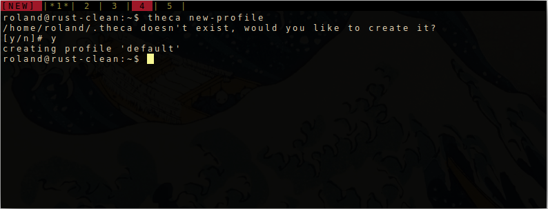

`theca new-profile` will create the `~/.theca` folder as well as the default
note profile in `~/.theca/default.json`. If you would like to use a non-standard
profile folder you can use `--profile-folder PATH`.

### Adding notes

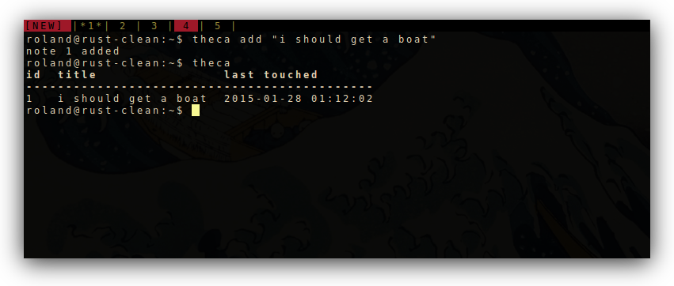

`theca add <title>` will add a note to the default profile with no body or status.
These flags can be used to add a note with a status and/or a body

	Statuses:
	    -s, --started                       Started status.
	    -u, --urgent                        Urgent status.

	Body:
	    -b BODY, --body BODY                Set body of the note to BODY.
	    -t, --editor                        Drop to $EDITOR to set/edit note body.
	    -                                   Set body of the note from STDIN.

### Editing notes

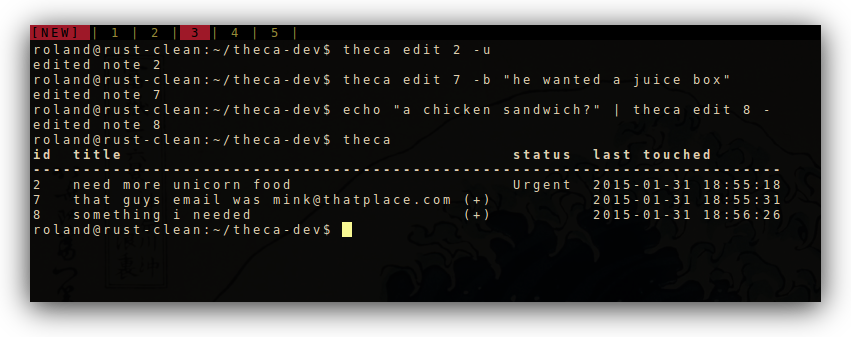

`theca edit <id>` is used to edit the title, status, or body of a note.

	Statuses:
	    -n, --none                          No status. (note default)
	    -s, --started                       Started status.
	    -u, --urgent                        Urgent status.

	Body:
	    -b BODY, --body BODY                Set body of the note to BODY.
	    -t, --editor                        Drop to $EDITOR to set/edit note body.
	    -                                   Set body of the note from STDIN.

### Deleting notes

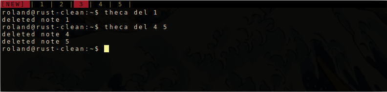

`theca del <id>..` deletes one or more notes specified by space separated note ids.

### List all notes

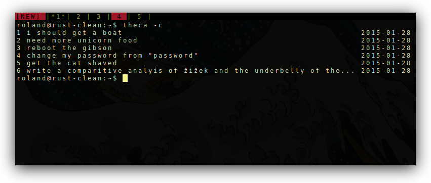

`theca` prints out all notes in the current profile, the following options can be
used to limit/sort the resulting list

	Printing format:
	    -c, --condensed                     Use the condensed printing format.
	    -j, --json                          Print list output as a JSON object.

	Note list formatting:
	    -l LIMIT, --limit LIMIT             Limit output to LIMIT notes.
	                                        [default: 0].
	    -d, --datesort                      Sort notes by date.
	    -r, --reverse                       Reverse list.

### View a single note

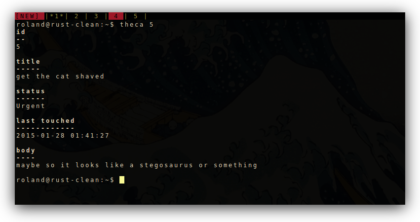

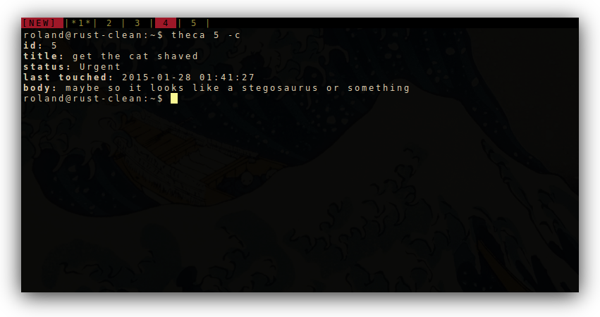

`theca <id>` prints out a single note, including the status and body, the following
options can be used to alter the output style

	Printing format:
	    -c, --condensed                     Use the condensed printing format.
	    -j, --json                          Print list output as a JSON object.

### Searching notes

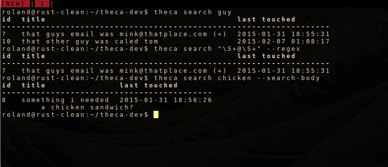

Notes can be search using either keyword or regex matching against note titles or bodies
using `theca search`.

	Search:
	    --search-body                       Search the body of notes instead of
	                                        the title.
	    --regex                             Set search pattern to regex (default
	                                        is keyword).

### Non-default profiles

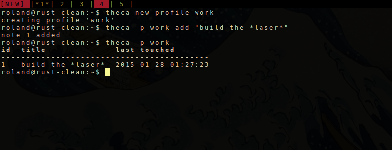

New named profiles can be created with the `theca new-profile <name>` command and will be
stored alongside `default.json` in either `~/.theca/` or in the folder specified by
`--profile-folder PATH`.

#### Setting the default profile

The default profile that `theca` loads (normalled `default`) can be changed by setting the
environment variable `THECA_DEFAULT_PROFILE`.

#### Setting the default profile folder

The default profile folder can also be set via a enviroment variable, `THECA_PROFILE_FOLDER`.

#### List all profiles

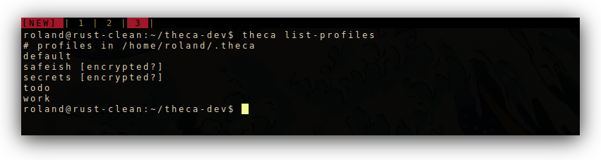

All profiles in the current profile folder can be view using `theca list-profiles`.

#### Transfer a note to another profile

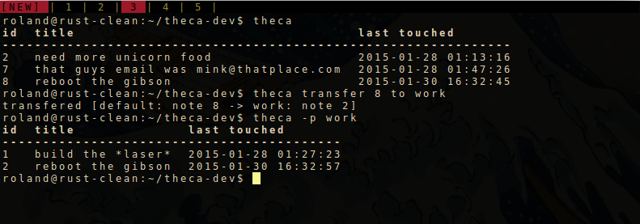

`theca transfer <id> to <name>` transfers a note from the current profile (in this case
`default`) to another profile.

#### Import a note from another profile

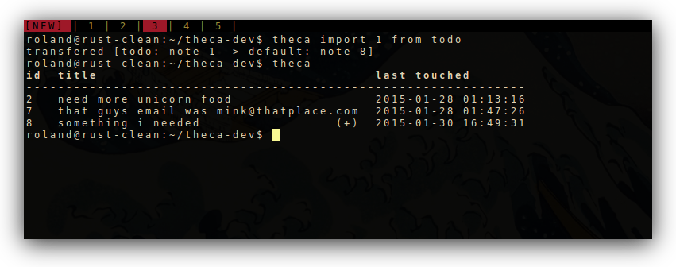

`theca import <id> from <name>` transfers a note from the profile `<name>` to
the current profile (in this case `default`).

#### Encrypted profiles

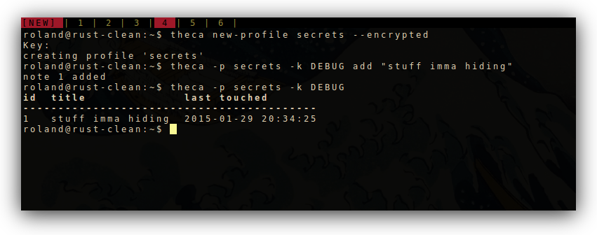

Using `--encrypted` tells theca that it should be dealing with encrypted profiles, so
using `theca --encrypted new-profile secrets` theca knows to create an encrypted profile
and will ask you for a key to encrypt the resulting `secrets.json`. If you'd like not to
be prompted you can specify it with the argument `--key KEY`.

`--encrypted` and `--key` can be used with all the other commands that read or write a
profile to specify that the profile you want to use will need to be encrypted/decrypted.

	Encryption:
	    -e, --encrypted                     Specifies using an encrypted profile.
	    -k KEY, --key KEY                   Encryption key to use for encryption/
	                                        decryption, a prompt will be
	                                        displayed if no key is provided.

##### Decrypt a encrypted profile

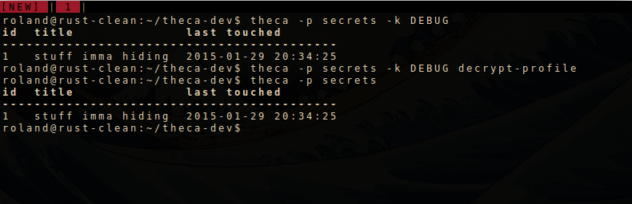

You can decrypt an encrypted profile in place using `theca decrypt-profile`.

##### Encrypt a plaintext profile

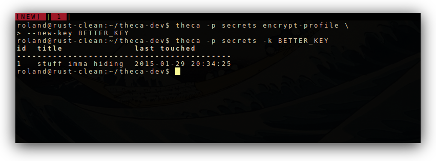

You can also encrypt a profile in place using `theca encrypt-profile [--new-key KEY]`, if `--new-key`
isn't used you will be prompted for the encryption key to use to encrypt the profile.

    --new-key KEY                       Specifies the encryption key for a
                                        profile when using `encrypt-profile`,
                                        a prompt will be displayed if no key
                                        is provided.

##### Changing the encryption key for an already encrypted profile

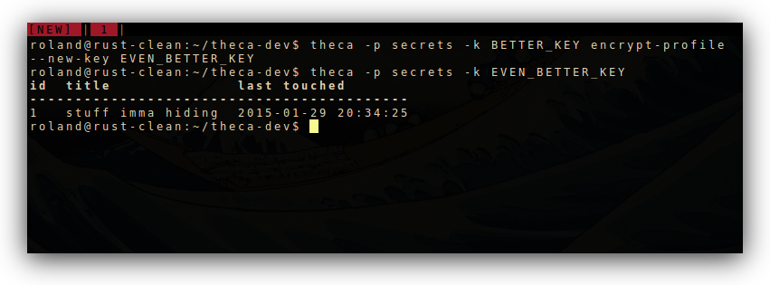

You can also use `theca encrypt-profile --new-key KEY` to change the encryption key of an already encrypted profile which is pretty cool and avoids the user having to do `encrypted with old key -> plaintext 
-> encrypted with new key`!

#### Synchronizing profiles

If you use a synchronization tool like Dropbox, ownCloud, BitTorrent Sync, or even some obscure
`rsync` setup you can easily share your note profiles between machines by using
`--profile-folder` to specify a folder for your profiles that is synced and your sync'r should
do the rest for you. Since `theca` makes transactional*-ish* updates to the profile files it
should be perfectly safe, unless you concurrently edit a profile, *though* `theca` will *attempt*
to merge changes when this happens. You could even store a profle in a *git* repository if you
really wanted to.

### JSON output mode

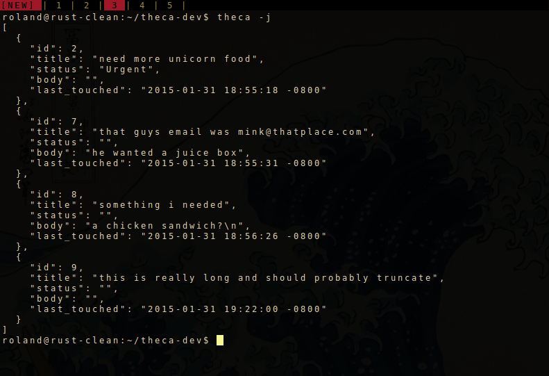

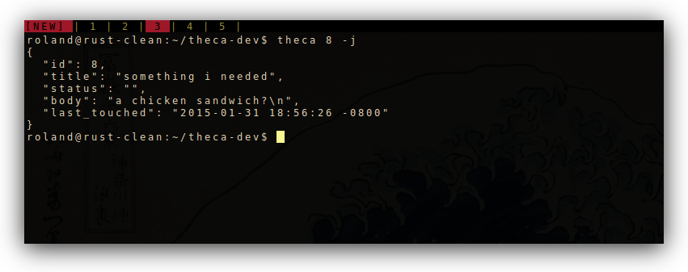

You can view a single note or note list (using `theca` or `theca search`) to output the
result as either a JSON object or list of JSON objects by passing the `--json` or `-j` flag.
This works with the standard limit formatting arguments like `-r`, `-d`, and `-l LIMIT`.

	Printing format:
	    -j, --json                          Print list output as a JSON object.

	Note list formatting:
	    -l LIMIT, --limit LIMIT             Limit output to LIMIT notes
	                                        [default: 0].
	    -d, --datesort                      Sort notes by date.
	    -r, --reverse                       Reverse list.

## Tab completion

There are preliminary `bash` and `zsh` tab completion scripts in the `completion/` directory
which can be installed manually or by using the `--bash-complete` or `--zsh-complete` flags with
`sudo bash tools/build.sh install` when installing the `theca` binary or by default when using the binary `installer.sh`. They both need quite a bit of 
work but are still relatively usable for the time being.

## man page

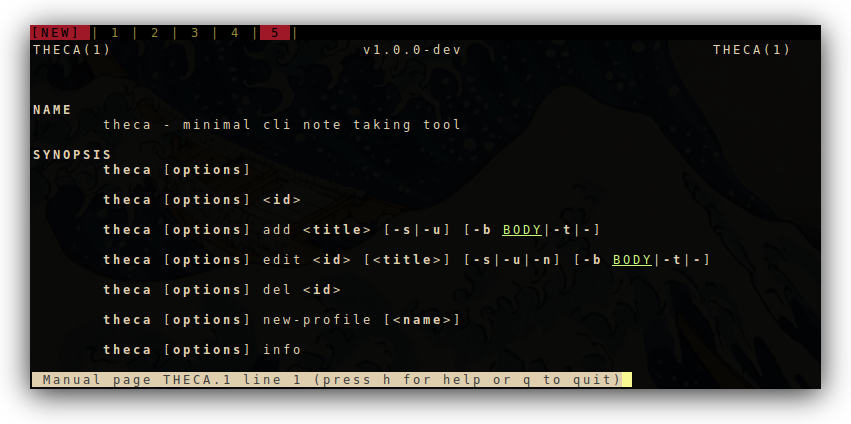

`theca` uses `md2man-roff` from [md2man](https://github.com/sunaku/md2man) to convert
`docs/THECA.1.md` to the roff format man page `docs/THECA.1`.

## Contributing

If you think I've left out some necessary feature feel free to open an issue or to fork the
project and work on a patch that introduces it.

I'm pretty sure there are quite a few places where memory optimizations could be made, as well
as various other performance and (extensive) design improvements.

Any and all pull requests will be considered and tremendously appreciated.

### Bugs

`theca` almost certainly contains bugs, I haven't had the time to write as many test cases as are really
necessary to fully cover the codebase. if you find one, please submit a issue explaining how to trigger
the bug, and if you're really awesome a test case that exposes it.

### TODO

* clean-ups/optimizations pretty much everywhere
* `ThecaProfile` and `ThecaItem` and assosiated functions should be moved out of `src/theca/lib.rs`
  to their own file
* `list-profiles` should be alphabetic
* `bash_complete.sh` could use a lot of improvement, `_theca` also, but less...
* `save_to_file` and `transfer_note` (and inherently the `import` logic) could use some
  work, specifically the profile changed stuff... <-- because of that we have pass pretty
  much all of the `Args` struct
* probably the bold/plain line printing could be done cleaner... (macro perhaps?)
* (long term) `remote` encrypted storage (some kind of super simple standalone REST API to hold
  encrypted profile blobs + client integrated into `theca` to retrieve them)

## Development

### JSON profile format

As described much more verbosely in `docs/schema.json`, this is what a note profile might look like

    {
        "encrypted": false,
        "notes": [
            {
                "id": 1,
                "title": "\\(◕ ◡ ◕\\)",
                "status": "",
                "body": "",
                "last_touched": "2015-01-22 15:01:39 -0800"
            },
            {
                "id": 3,
                "title": "(THECA) add super secret stuff",
                "status": "",
                "body": "",
                "last_touched": "2015-01-22 15:21:01 -0800"
            }
        ]
    }

### Cryptographic design

`theca` uses the AES CBC mode symmetric cipher (implementation provided by [*rust-crypto*](https://github.com/DaGenix/rust-crypto)) with a 256-bit key to encrypt/decrypt
profile files. The key is derived using *pbkdf2* (using the sha-256 *PRF*, again from *rust-crypto*) with 2056 rounds
salted with the sha256 hash of the password used for the key derivation (probably not the best idea).

#### Basic Python implementation

During development it can be quite useful to encrypt/decrypt profiles using a scripting
language like Python. A key can be derived quite quickly using `hashlib` and `passlib`

	from hashlib import sha256
	from passlib.utils.pbkdf2 import pbkdf2

	passphrase = "DEBUG"
	key = pbkdf2(
        bytes(passphrase.encode("utf-8")),
        sha256(bytes(passphrase.encode("utf-8"))).hexdigest().encode("utf-8"),
        2056,
        32,
        "hmac-sha256"
    )

and the ciphertext can be decrypted using the AES implementation from `pycrypto`

	from Crypto.Cipher import AES

	# the IV makes up the first 16 bytes of the ciphertext
	iv = ciphertext[0:16]
    decryptor = AES.new(key, AES.MODE_CBC, iv)
    plaintext = decryptor.decrypt(ciphertext[16:])

    # remove any padding from the end of the final block
    plaintext = plaintext[:-plaintext[-1]].decode("utf-8")

### `tools/build.sh`

`build.sh` is a pretty simple `bash` holdall in lieu of a `Makefile` (ew) that really exists
because I have a bad memory and forget some of the commands i'm supposed to remember. It will also
set the build version environment variable (`THECA_BUILD_VER`) which is used to set the verson `theca -v`.

Usage is pretty simple

	$ bash tools/build.sh
	Usage: build.sh {build|build-man|test|install|clean}

* `build` passes through any argument to `cargo build` so things like `--release` and
  `--verbose` work fine
* `build-man` requires the `md2man-roff` tool to convert the Markdown man page to the
  roff man page format
* `test` runs both all the Rust tests (`cargo test`) and all the Python harness tests
* `install` copies the binary to `/usr/local/bin`. It can also be used with `--man`,
  `--bash-complete`, or `--zsh-complete` to install the man page, `bash` completion script,
  or the `zsh` completion script manually.
* `clean` deletes the binary in `.`, the `target/` folder, and the man page in `docs/`
  if they exist

### `tools/theca_test_harness.py`

`theca_test_harness.py` is a *relatively* simple python3 test harness for the compiled `theca` binary.
It reads in JSON files which describe test cases and executes them, providing relatively simple
information like passed/failed/time taken.

The harness can preform three different output checks, against
 * the resulting profile file
 * the JSON output of view, list, and search commands
 * the text output of add, edit, delete commands, etc

The python script has a number of arguments that may or may not be helpful

	$ python3 tools/theca_test_harness.py -h
	usage: theca_test_harness.py [-h] [-tc THECA_COMMAND] [-tf TEST_FILE] [-pt]
	                             [-jt] [-tt]

	test harness for the theca cli binary.

	optional arguments:
	  -h, --help            show this help message and exit
	  -tc THECA_COMMAND, --theca-command THECA_COMMAND
	                        where is the theca binary
	  -tf TEST_FILE, --test-file TEST_FILE
	                        path to specific test file to run
	  -pt, --profile-tests  only run the profile output tests
	  -jt, --json-tests     only run the json output tests
	  -tt, --text-tests     only run the text output tests

#### Test suite file format

A JSON test suite file for `theca_test_harness.py` looks something like this

	{
	  "title": "GOOD DEFAULT TESTS",
	  "desc": "testing correct input with the default profile.",
	  "tests": [
	  	...
	  ]
	}

##### Test formats

* a profile result test looks something like this

		{
	      "name": "add note",
	      "cmds": [
	        ["new-profile"],
	        ["add", "this is the title"]
	      ],
	      "result_path": "default.json",
	      "result": {
	        "encrypted": false,
	        "notes": [
	          {
	            "id": 1,
	            "title": "this is the title",
	            "status": "",
	            "body": ""
	          }
	        ]
	      }
	    }

* a JSON output test looks something like this

		{
	      "name": "list",
	      "cmds": [
	        ["new-profile"],
	        ["add", "a title this is"],
	        ["add", "another title this is"],
	        ["-j"]
	      ],
	      "result_type": "json",
	      "results": [
	        null,
	        null,
	        null,
	        [
	          {
	            "id": 1,
	            "title": "a title this is",
	            "status": "",
	            "body": ""
	          },{
	            "id": 2,
	            "title": "another title this is",
	            "status": "",
	            "body": ""
	          }
	        ]
	      ]
	    }

* a text output test looks something like this

		{
	      "name": "new-profile",
	      "cmds": [
	        ["new-profile"]
	      ],
	      "result_type": "text",
	      "results": [
	        "creating profile 'default'\n"
	      ]
	    }

## Author

`theca` is written by roland shoemaker (<rolandshoemaker@gmail.com>), this is my first foray
into a Rust project and my first time diving back into a systems language since 2007 or so,
so please excuse the messiness of some of the code, dynamic languages have ruined me.

## License

`theca` is licensed under the MIT license, the full text of which can be found at
<http://opensource.org/licenses/MIT> or in `LICENSE`.
